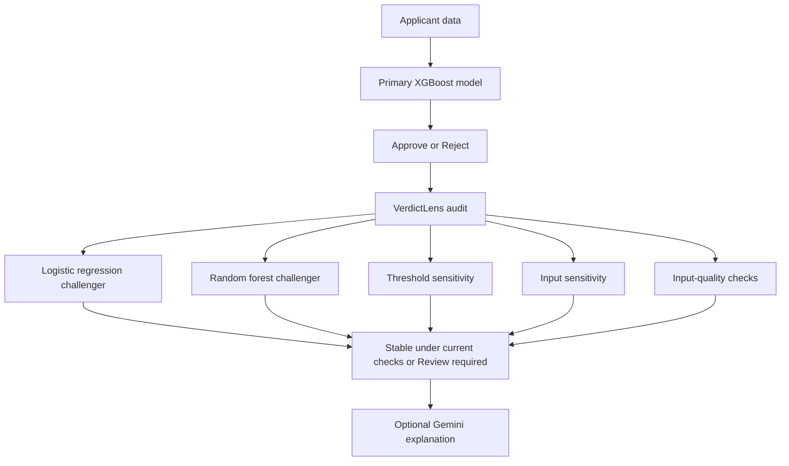

# VerdictLens

VerdictLens is a decision-audit prototype for machine-learning loan-risk systems. It keeps the original model decision visible, then examines how stable that decision is under alternative models, nearby thresholds, controlled input probes, and input-quality checks.

The project does **not** claim that an approval or rejection is correct, fair, or legally compliant. It surfaces evidence that can help a human reviewer understand when a model-dependent decision deserves closer inspection.

## Project status

| Component | Status | Purpose |
|---|---|---|
| [`prototype/`](prototype/) | Working prototype — files being added | Validates the complete local workflow with Streamlit |
| [`final-app/`](final-app/) | Planned | Rebuilds the experience with the final visual design and product flow |
| VerdictLens audit core | Implemented in the prototype | Produces deterministic review signals without relying on an LLM |
| Gemini explanation | Optional in the prototype | Converts completed audit evidence into plain language |

## How it works



The primary model estimates the probability of serious delinquency and applies its frozen decision threshold. VerdictLens never overrides that output. Its audit result answers a different question: did the configured checks find disagreement, instability, or input-quality evidence that a person should inspect?

### Possible results

| Primary decision | Audit status | Interpretation |
|---|---|---|
| `APPROVE` | Stable under current checks | The configured checks found no review flag |
| `APPROVE` | Review required | The approval remains in place, but audit evidence deserves inspection |
| `REJECT` | Stable under current checks | The configured checks found no review flag |
| `REJECT` | Review required | The rejection remains in place, but audit evidence deserves inspection |

Review flags can identify model-policy disagreement, common-threshold disagreement, threshold sensitivity, input sensitivity, and input-quality concerns. A flag is diagnostic evidence rather than proof of an incorrect or unfair decision.

## Repository structure

```text
Verdict-Lens/
├── prototype/       Working local Streamlit implementation
│   └── README.md
├── final-app/       Final product interface, currently planned
│   └── README.md
├── .gitignore
└── README.md
```

The prototype and final application are separated so the repository preserves the project's development history. The deterministic audit engine should remain the shared source of truth as the interface evolves.

## Run the prototype

After the prototype files have been added:

```bash
cd prototype
python -m venv .venv
python -m pip install -r requirements.txt
python -m streamlit run app.py
```

On Windows, activate the environment before installing dependencies:

```bat
.venv\Scripts\activate
```

Streamlit normally opens the application automatically. Otherwise, visit [http://localhost:8501](http://localhost:8501).

For complete setup, Gemini configuration, JSON input format, tests, and audit semantics, see the [prototype documentation](prototype/README.md).

## Design principles

- **Preserve the original decision.** The audit reports evidence and never silently replaces the primary model's output.
- **Keep the core deterministic.** The same applicant and frozen artifacts produce the same structured audit result.
- **Separate computation from explanation.** Gemini may explain an audit after it is complete, but it cannot set or modify scores, thresholds, flags, or decisions.
- **Expose uncertainty honestly.** `NO_FLAGS_IN_CHECKS` only means the configured checks found no flags.
- **Keep sensitive configuration out of Git.** API keys belong in environment variables or ignored local secrets files.

## Current limitations

- The models are research and hackathon artifacts, not production lending systems.
- Challenger agreement does not prove that a decision is correct.
- All trained models may inherit patterns and errors from their historical data.
- Local sensitivity probes are diagnostics, not causal explanations or applicant advice.
- VerdictLens is not a fairness certification, legal review, or automated appeal mechanism.
- The primary model currently supports one fixed ten-feature loan-risk schema.

## Roadmap

- [x] Train and preserve the primary loan-risk model
- [x] Add two challenger model families
- [x] Add deterministic threshold, input-sensitivity, and input-quality checks
- [x] Create a local Streamlit workflow prototype
- [x] Add optional Gemini explanations downstream of the audit
- [x] Add JSON import for repeatable test cases
- [ ] Add the working prototype files to `prototype/`
- [ ] Design and implement the final application
- [ ] Add screenshots and a short demonstration recording
- [ ] Complete broader evaluation and document observed failure modes

## Security

Never commit Gemini API keys, `.env` files, Streamlit secrets, virtual environments, or local caches. Serialized Python model files should be loaded only when their source is trusted.

## License

No license has been selected yet. Until a license file is added, normal copyright restrictions apply. Choose a license before inviting external reuse or contributions.
