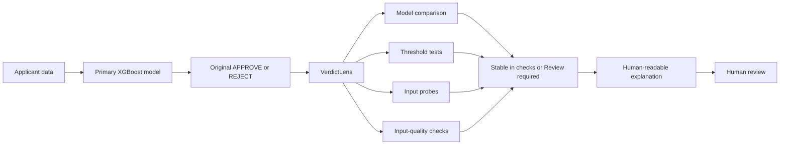

# VerdictLens

### Decision auditing for high-stakes machine-learning predictions

VerdictLens is a local prototype that helps a person inspect a loan-risk model decision before trusting it. It records the original prediction, compares it with two challenger models, tests whether small threshold or input changes alter the outcome, checks input quality, and presents the evidence for human review.

> **The central rule:** VerdictLens never silently changes the primary model's decision. It adds evidence around that decision.

## The problem

A machine-learning model can produce an answer without showing how stable that answer is. A rejection may sit barely above a cutoff, another reasonable model may disagree, or a tiny input change may flip the outcome. A normal prediction screen hides these facts.

VerdictLens makes them visible. It answers:

1. What did the original model decide?
2. How close was the score to the decision threshold?
3. Do different model families agree?
4. Does the result survive nearby threshold changes?
5. Does it survive small, controlled input changes?
6. Are any inputs missing, ambiguous, or unusual?
7. Should a person inspect the case more closely?

## Repository status

| Area | Status | Purpose |
|---|---|---|
| [`prototype/`](prototype/) | Complete | Original Streamlit implementation used to prove the local model and audit workflow |
| [`final-app/`](final-app/) | Complete | Polished Next.js interface connected to the real local Python engine |
| Deterministic audit engine | Complete | Produces repeatable predictions, evidence, flags, and audit status |
| Gemini explanation layer | Complete | Explains recorded results in plain language without changing them |

## One-minute explanation



The primary decision and audit evidence are calculated locally. Gemini receives a reduced, completed result only to turn it into plain language. It cannot set a risk score, threshold, flag, decision, or audit status.

## Models and decision logic

| Component | Role | Output |
|---|---|---|
| **XGBoost** | Primary model | Serious-delinquency risk estimate and the original `APPROVE` or `REJECT` decision |
| **Logistic regression** | Challenger | A simpler additive model comparison with its own frozen threshold |
| **Random forest** | Challenger | A different nonlinear model comparison with its own frozen threshold |
| **VerdictLens rules** | Audit engine | `NO_FLAGS_IN_CHECKS` or `REVIEW`, plus structured evidence |
| **Gemini Flash** | Explanation layer | Plain-language explanation of an already-computed result |

The frozen thresholds are:

| Model | Decision threshold |
|---|---:|
| Primary XGBoost | 17.8669736% |
| Logistic regression | 12.7008693% |
| Random forest | 10.1377354% |

For each model, a risk estimate below its threshold produces `APPROVE`; a value at or above it produces `REJECT`.

## Dataset, training, and evaluation

The preserved training archive contains `cleaned_labeled_data.csv` with **149,391 labeled applicant rows** after **609 duplicate IDs** were excluded. The binary target is serious delinquency within the model's prediction period. Missing values were retained until pipeline preprocessing, and the natural class balance was preserved: there was no oversampling or class weighting. The positive-class prevalence in the untouched test set is approximately **6.70%**.

| Split | Rows | Use |
|---|---:|---|
| Training | 89,634 | Fit the primary and challenger models |
| Calibration | 14,938 | Calibrate challenger probabilities |
| Policy selection | 14,940 | Choose challenger decision thresholds without using test data |
| Test holdout | 29,879 | Final model evaluation only |

The primary pipeline applies fixed feature ordering, converts age zero to missing, and uses median imputation with missing indicators before XGBoost. The challengers use the same ten applicant features. Logistic regression additionally uses `log1p` transformations and standardization; both challengers use sigmoid probability calibration. This is conventional model training rather than LLM fine-tuning.

### Frozen configurations

| Model | Main configuration | Threshold selection |
|---|---|---|
| XGBoost | 400 trees, depth 3, learning rate 0.04, minimum child weight 10, 0.85 row subsampling, 0.90 column subsampling, L2 regularization 5 | Maximum positive-class F1 on the original validation data |
| Logistic regression | Median imputation, missing indicators, `log1p`, standardization, L2 regularization with C=1 | Maximum F1 on the separate policy subset |
| Random forest | 180 trees, maximum depth 16, minimum leaf size 25, 80% feature sampling | Maximum F1 on the separate policy subset |

### Untouched holdout results

| Model | ROC AUC | Average precision | Brier ↓ | Precision | Recall | F1 |
|---|---:|---:|---:|---:|---:|---:|
| XGBoost | **0.8696** | **0.4152** | **0.0483** | **0.3952** | 0.5549 | **0.4617** |
| Logistic regression | 0.8389 | 0.3724 | 0.0516 | 0.3821 | 0.5040 | 0.4346 |
| Random forest | 0.8659 | 0.4135 | 0.0495 | 0.3685 | **0.5774** | 0.4499 |

Plain accuracy is intentionally not emphasized. With only about 6.70% positive cases, a majority-class prediction could appear accurate while missing the cases the model is meant to detect. ROC AUC measures ranking, average precision reflects performance on the rare positive class, F1 balances precision and recall, and Brier score measures probability error.

The complete provenance, imputation medians, calibration notes, and evaluation caveats are preserved in [`prototype/provenance/ORIGINAL_AUDIT_REPORT.md`](prototype/provenance/ORIGINAL_AUDIT_REPORT.md).

## What VerdictLens checks

| Check | Question | Possible review flag |
|---|---|---|
| Input quality | Is a value missing, ambiguous, or outside configured reference ranges? | `INPUT_QUALITY_REVIEW` |
| Model policy comparison | Does a challenger disagree using its own threshold? | `MODEL_POLICY_DISAGREEMENT` |
| Common-threshold comparison | Does a challenger disagree at the primary threshold? | `COMMON_THRESHOLD_DISAGREEMENT` |
| Threshold sensitivity | Does moving the primary threshold by ±1 or ±2 percentage points change the result? | `THRESHOLD_SENSITIVE` |
| Input sensitivity | Does a small controlled input probe change the result? | `INPUT_SENSITIVE` |

Any configured flag produces `REVIEW`. With no flags, the internal result is `NO_FLAGS_IN_CHECKS`, shown in the interface as **Stable in configured checks**. Neither status proves that a decision is correct, fair, or legally compliant.

## Possible outcomes

The primary decision and audit status are deliberately separate:

| Primary output | Audit output | Meaning |
|---|---|---|
| `APPROVE` | Stable in checks | The approval remained stable in the configured checks |
| `APPROVE` | Review required | The approval remains recorded, but the evidence deserves inspection |
| `REJECT` | Stable in checks | The rejection remained stable in the configured checks |
| `REJECT` | Review required | The rejection remains recorded, but the evidence deserves inspection |

## Repository structure

```text
Verdict-Lens/
├── prototype/                 Original Streamlit proof of concept
│   ├── app.py                 Streamlit interface
│   ├── verdictlens/           Reusable deterministic audit package
│   ├── models/                Frozen model artifacts and audit policy
│   ├── tests/                 Regression and behavior tests
│   ├── reports/               Saved verification evidence
│   └── README.md              Prototype setup and technical guide
├── final-app/                 Final local application
│   ├── app/                   Next.js pages, workflow, and visual design
│   ├── lib/                   Browser-to-local-API client
│   ├── backend/               FastAPI, models, audit engine, and SQLite store
│   ├── start-verdictlens.ps1  One-command Windows launcher
│   └── README.md              Final application guide
├── .gitignore                 Excludes secrets, dependencies, caches, and local data
└── README.md                  Project overview
```

## Which version should I run?

- Use **[`final-app/`](final-app/)** for the complete demonstration and polished user experience.
- Use **[`prototype/`](prototype/)** to inspect the original Streamlit workflow, run regression tests, or call the Python audit package directly.

## Quick start: final application

You need **Python 3.11**, **Node.js with npm**, and a **Gemini API key** for the current guided UI.

```powershell
cd final-app\backend
python -m pip install -r requirements.txt
cd ..
npm install
powershell -ExecutionPolicy Bypass -File .\start-verdictlens.ps1
```

Open [http://localhost:3000](http://localhost:3000). The launcher starts the Python engine on port `8000` and the website on port `3000`. See the [final application guide](final-app/README.md) for manual startup, troubleshooting, testing, and API details.

## Applicant data

The models accept exactly ten fields:

```json
{
  "RevolvingUtilizationOfUnsecuredLines": 0.536575875,
  "age": 35,
  "NumberOfTime30-59DaysPastDueNotWorse": 1,
  "DebtRatio": 0.692470557,
  "MonthlyIncome": 7556.0,
  "NumberOfOpenCreditLinesAndLoans": 16,
  "NumberOfTimes90DaysLate": 0,
  "NumberRealEstateLoansOrLines": 1,
  "NumberOfTime60-89DaysPastDueNotWorse": 0,
  "NumberOfDependents": 0
}
```

The interface supports manual entry, pasted JSON, and JSON file import. `MonthlyIncome` and `NumberOfDependents` may be unavailable and represented as `null`; the model pipeline imputes them and the audit records an input-quality finding.

## Evaluation highlights

| Criterion | Evidence in this repository |
|---|---|
| Technical implementation | Frozen XGBoost, logistic-regression, and random-forest pipelines with deterministic audit modules |
| AI integration | Gemini explains the primary result and audit after deterministic computation |
| Innovation | Separates a model decision from evidence about its stability and contestability |
| UI/UX | Guided three-stage workflow, JSON import, visual evidence paths, animations, case library, and accessible status language |
| Reproducibility | Local execution, pinned Python ML dependencies, artifact hashes, regression fixtures, and verification reports |
| Responsible design | No automatic override, explicit limitations, structured flags, and human-review framing |

## Verification and integrity

The model manifest stores SHA-256 hashes for the primary model, challenger bundle, and canonical audit configuration. Artifacts are checked before inference so accidental or unexpected changes fail clearly. The prototype verification suite also checks deterministic behavior, original saved outputs, strict input validation, offline core execution, JSON import, and tamper rejection.

## Important limitations

- This is a hackathon and research prototype, not a production lending system.
- Model agreement is evidence, not proof of correctness.
- All models may inherit errors or bias from shared historical data.
- Local sensitivity probes are diagnostics, not causal explanations or applicant advice.
- `NO_FLAGS_IN_CHECKS` means only that the configured checks found no flag.
- VerdictLens is not a fairness certificate, legal opinion, compliance system, or automated appeal mechanism.

## Privacy and security

- Model inference and case storage run locally.
- Final-app cases are stored in a local SQLite database that is ignored by Git.
- A Gemini key entered in the website is sent to the local backend for that request and is not saved in the case database.
- Never commit `.env` files, API keys, local databases, virtual environments, `node_modules`, or build outputs.
- Load serialized Python model files only from a trusted source.

## Documentation

- [Run and test the Streamlit prototype](prototype/README.md)
- [Run and understand the final application](final-app/README.md)
- [Read the prototype verification report](prototype/reports/VERIFICATION.md)
- [Read the preserved original audit report](prototype/provenance/ORIGINAL_AUDIT_REPORT.md)

## License

No license has been selected. Until a license file is added, normal copyright restrictions apply.
