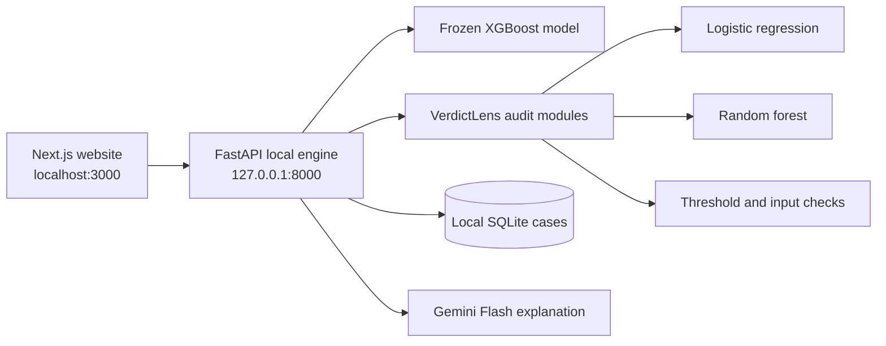

# VerdictLens Final Application

This is the complete local VerdictLens demonstration: a polished Next.js website connected to the real Python prediction and audit engine. It is designed for judges, demonstrations, and workflow testing while keeping model artifacts and case data on the local machine.

## What the application does

1. Accepts an applicant through a form or JSON import.
2. Requires and validates a Gemini API key for the guided final workflow.
3. Runs the frozen XGBoost model locally.
4. Shows the original `APPROVE` or `REJECT` decision, risk, threshold, and margin.
5. Uses Gemini to explain why the recorded result crossed the decision boundary.
6. Runs the deterministic VerdictLens audit locally.
7. Displays model disagreements, threshold sensitivity, input sensitivity, input-quality findings, flags, and limitations.
8. Uses Gemini to explain the completed audit without changing it.
9. Stores case records in a local SQLite database and allows audit JSON download.

## Architecture



The browser never loads the joblib model artifacts. It sends applicant values to the local Python backend, which validates the data, computes the result, saves the case locally, and returns structured JSON.

## Before you start

Install:

- **Python 3.11**
- **Node.js** with npm
- A **Gemini API key** for the current final-interface workflow
- Internet access for dependency installation and Gemini explanations

The prediction and audit algorithms themselves are deterministic and can run offline. The final website intentionally blocks the guided workflow until a Gemini key is validated because it presents an AI explanation at both result stages.

## First-time installation

Open PowerShell in `final-app/`.

### 1. Install the Python backend

```powershell
cd backend
python -m pip install -r requirements.txt
cd ..
```

Using a virtual environment is recommended:

```powershell
python -m venv .venv
.\.venv\Scripts\Activate.ps1
python -m pip install -r backend\requirements.txt
```

### 2. Install the website packages

```powershell
npm install
```

Do not commit `node_modules`; it is generated by npm and excluded by `.gitignore`.

## Start everything

The simplest Windows command is:

```powershell
powershell -ExecutionPolicy Bypass -File .\start-verdictlens.ps1
```

This starts:

- Website: [http://localhost:3000](http://localhost:3000)
- Local API: [http://127.0.0.1:8000](http://127.0.0.1:8000)
- Interactive API reference: [http://127.0.0.1:8000/docs](http://127.0.0.1:8000/docs)

Keep the terminal open. Press `Ctrl+C` to stop the website; the helper script also stops the backend process it started.

## Manual startup

Use two terminals when you want to see backend and frontend logs separately.

Terminal 1 — Python engine:

```powershell
cd backend
python -m uvicorn api:app --host 127.0.0.1 --port 8000 --reload
```

Terminal 2 — website:

```powershell
npm run dev
```

Then open [http://localhost:3000](http://localhost:3000).

## Gemini key behavior

You can paste the key into the secure password field on the New Audit page. The browser sends it to the local backend for validation and explanation requests. It is held in the current browser session state and is not written to the case database.

You may also set a backend environment variable before starting it:

```powershell
$env:GEMINI_API_KEY="your_key_here"
$env:GEMINI_MODEL="gemini-3.1-flash-lite"
```

The explanation layer tries the configured Flash model and configured Flash fallbacks when a model reports a temporary capacity error. Gemini receives a reduced result payload and cannot change any deterministic output.

## User workflow

### Home

Explains the product idea, the difference between a model result and audit evidence, and provides an animated overview of the workflow.

### New audit

- Enter the ten features manually.
- Mark monthly income or dependents unavailable.
- Paste one JSON object or import a JSON file.
- Download a correctly formatted JSON template.
- Enter the required Gemini key.
- Run the local loan decision.

### Original decision

Shows the primary XGBoost decision, estimated risk, fixed threshold, distance from the boundary, and Gemini's explanation. The user can then start the audit.

### Audit result

Shows the preserved primary result and the final audit status, then organizes all evidence into:

- Review signals
- Model comparison
- Threshold sensitivity
- Input sensitivity
- Input-quality findings
- Limitations
- Raw structured JSON
- Gemini plain-language interpretation

The full audit can be downloaded as JSON.

### Case library

Lists cases stored on the current computer. Selecting a case reopens its decision or completed audit. Local case databases are excluded from Git.

### How it works

Provides animated summary and detailed diagrams of the primary model, evidence checks, audit status, and human-review boundary.

### About & limitations

Explains the project's purpose, known limitations, responsible-use boundaries, and development roadmap.

## Models and evidence

| Component | Purpose | Threshold or behavior |
|---|---|---|
| Primary XGBoost | Produces the original serious-delinquency risk and decision | Reject at or above 17.8669736% |
| Logistic regression | Challenger comparison | Own threshold: 12.7008693% |
| Random forest | Challenger comparison | Own threshold: 10.1377354% |
| Threshold checks | Tests decision stability near the policy boundary | Primary threshold ±1 and ±2 percentage points |
| Input probes | Tests small controlled changes around one applicant | Records risk delta and whether the decision flips |
| Input-quality checks | Finds missing, ambiguous, and unusual values | Adds structured quality findings |

Any quality finding, challenger disagreement, threshold flip, or input-probe flip produces `REVIEW`. Otherwise, the backend returns `NO_FLAGS_IN_CHECKS`, displayed as **Stable in configured checks**.

### Training and performance summary

All three frozen models use the same ten-feature, **149,391-row** cleaned dataset. The split contains 89,634 training rows, 14,938 challenger-calibration rows, 14,940 policy-selection rows, and 29,879 untouched test rows. No oversampling or class weighting was used.

| Model | Key configuration | ROC AUC | Average precision | F1 |
|---|---|---:|---:|---:|
| XGBoost | 400 trees, depth 3, learning rate 0.04 | **0.8696** | **0.4152** | **0.4617** |
| Logistic regression | Standardized `log1p` features, L2 with C=1, sigmoid calibration | 0.8389 | 0.3724 | 0.4346 |
| Random forest | 180 trees, depth 16, leaf size 25, sigmoid calibration | 0.8659 | 0.4135 | 0.4499 |

The positive class is approximately 6.70% of the test set, so accuracy is not used as the headline metric. Full preprocessing, thresholds, Brier scores, precision, recall, split controls, and caveats are documented in the [prototype model section](../prototype/README.md#training-data-and-splits) and [original audit report](../prototype/provenance/ORIGINAL_AUDIT_REPORT.md).

## Applicant JSON format

Paste one object or a list of complete objects:

```json
{
  "RevolvingUtilizationOfUnsecuredLines": 0.536575875,
  "age": 35,
  "NumberOfTime30-59DaysPastDueNotWorse": 1,
  "DebtRatio": 0.692470557,
  "MonthlyIncome": 7556.0,
  "NumberOfOpenCreditLinesAndLoans": 16,
  "NumberOfTimes90DaysLate": 0,
  "NumberRealEstateLoansOrLines": 1,
  "NumberOfTime60-89DaysPastDueNotWorse": 0,
  "NumberOfDependents": 0
}
```

All keys are required. Values must be finite and nonnegative. Age and count fields must be integers. `MonthlyIncome` and `NumberOfDependents` may be `null` when unavailable; this is recorded as an input-quality finding.

## Local API

| Method | Route | Purpose |
|---|---|---|
| `GET` | `/api/health` | Engine readiness, model policy, thresholds, and row counts |
| `GET` | `/api/schema` | Ten-field schema, help text, and reference ranges |
| `POST` | `/api/import` | Validate one or more pasted JSON cases |
| `POST` | `/api/gemini/validate` | Validate a supplied Gemini key |
| `POST` | `/api/predict` | Create a case and run the primary model |
| `POST` | `/api/explain-primary` | Explain the recorded primary result |
| `POST` | `/api/audit` | Audit an existing case or supplied applicant |
| `POST` | `/api/explain` | Explain the completed audit |
| `GET` | `/api/cases` | Search and filter local cases |
| `GET` | `/api/cases/{case_ref}` | Retrieve one complete case |
| `DELETE` | `/api/cases/{case_ref}` | Delete one local case |

## Verify the project

### Backend smoke test

Start the backend, open another terminal in `final-app/backend`, then run:

```powershell
python smoke_test.py
```

This exercises health, schema, import, prediction, audit, validation errors, quality flags, local case storage, retrieval, filtering, and deletion.

### Frontend checks

From `final-app/`:

```powershell
npx tsc --noEmit
npm run build
```

## Folder guide

```text
final-app/
├── app/
│   ├── page.tsx                 Application shell and informational pages
│   ├── live-workflow.tsx        Real applicant, decision, audit, and case flows
│   ├── how-it-works-page.tsx    Detailed interactive explanation
│   ├── visual-flows.tsx         Animated workflow diagrams
│   └── globals.css              Complete visual system and responsive styles
├── lib/verdictlens.ts           Typed local API client
├── backend/
│   ├── api.py                   FastAPI routes
│   ├── store.py                 Local SQLite case storage
│   ├── verdictlens/             Deterministic audit package
│   ├── models/                  Frozen artifacts, manifest, and audit policy
│   ├── examples/                Sample applicant JSON
│   ├── smoke_test.py            End-to-end local API verification
│   └── requirements.txt         Python dependencies
├── public/                      Icons and static assets
├── start-verdictlens.ps1        Windows launcher
├── package.json                 Website dependencies and commands
└── .env.example                Safe configuration template
```

## Troubleshooting

### `Cannot reach the local VerdictLens engine`

The website is running but the Python backend is not. Start Uvicorn in `final-app/backend` on port `8000`.

### `WinError 10013` or port 8000 is unavailable

Check for a listening process:

```cmd
netstat -ano | findstr :8000
```

If a stale backend shows `LISTENING`, stop its PID:

```cmd
taskkill /PID YOUR_PID /F
```

Then start the correct backend again. `TIME_WAIT`, `FIN_WAIT_2`, and `CLOSE_WAIT` entries without `LISTENING` usually disappear on their own.

### Artifact integrity check failed

Restore the matching files in `backend/models/` from Git. Do not edit the joblib files or model configuration manually. The configuration hash uses canonical JSON so Windows line-ending conversion does not create a false mismatch.

### Gemini returns 429 or 503

These normally indicate temporary quota or capacity pressure. Wait briefly and retry. The backend also tries configured Flash fallback models for retryable capacity errors.

### The website starts on port 3001

Another process is already using port `3000`. Stop the older frontend process, or continue on `3001`; the backend allows both local development origins.

## Security and privacy

- The API binds to `127.0.0.1` for local use.
- Model artifacts remain in the backend.
- Cases are stored in a local ignored database.
- API keys must never be committed.
- `.env`, local databases, `node_modules`, `.next`, caches, and logs are excluded from Git.
- Serialized joblib artifacts should be loaded only from a trusted repository copy.

## Limitations

VerdictLens is a hackathon and research prototype. It does not prove that a decision is correct or fair, provide legal compliance, identify causation, recommend how an applicant should change, or replace human review. Models trained on related historical data may share errors even when they agree.
